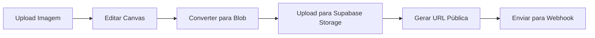

# Guia de Teste - Envio de Posts para Instagram

## ✅ Problema Corrigido

O erro ao enviar posts para o Instagram foi **identificado e resolvido**.

### Problema
Usuários com role `gestor` não conseguiam fazer upload de imagens para o Instagram devido a políticas de permissão incompletas no bucket `social-posts`.

### Solução
- ✅ Políticas do bucket `social-posts` atualizadas para incluir role `gestor`
- ✅ Adicionada política de UPDATE que estava faltando
- ✅ Melhorado tratamento de erros com mensagens mais amigáveis

---

## Como Testar

### 1. Acesse o Sistema

No browser de desenvolvimento que está aberto, faça login com um usuário que tenha uma das seguintes roles:
- `admin`
- `redator`
- `gestor`

### 2. Navegue para o Gerador de Posts do Instagram

```
http://localhost:8080/admin
```

Após o login, procure pela opção de **"Instagram"** ou **"Posts Sociais"** no menu administrativo.

### 3. Crie um Post

**Passo 1: Editor**
1. Faça upload de uma imagem (JPG, PNG ou WebP, máximo 10MB)
2. Ajuste o zoom e posição da imagem
3. Adicione um título/texto
4. Ajuste tamanho, posição e cor do texto
5. Clique em **"Continuar para Finalizar"**

**Passo 2: Finalização**
1. Adicione uma legenda para o Instagram
2. (Opcional) Agende o post selecionando data e hora
3. Clique em **"Enviar Agora"** ou **"Agendar Post"**

### 4. Verifique o Console do Browser

Abra o Console do navegador (F12) e observe os logs:

**Logs de Sucesso Esperados:**
```
🚀 [INSTAGRAM] Iniciando sendInstagramPost...
📊 [INSTAGRAM] Convertendo canvas para blob...
✅ [INSTAGRAM] Canvas convertido para blob: [tamanho] bytes
📤 Fazendo upload para storage: instagram-post-[timestamp].jpg
✅ Upload realizado com sucesso
🔗 URL pública gerada: [URL]
📨 Enviando payload para webhook
✅ Resposta do webhook: [resposta]
```

**Se houver erro:**
- O sistema agora mostra mensagens de erro mais detalhadas
- Verifique se seu usuário tem a role adequada
- Verifique se a URL do webhook está configurada

---

## Arquitetura do Sistema

### Fluxo de Envio



### Componentes Envolvidos

1. **InstagramPostGenerator.tsx**
   - Gerencia os passos (editor → finalização)
   - Controle de estado dos dados do post

2. **InstagramEditor.tsx**
   - Upload e manipulação de imagem
   - Configuração de texto e estilo
   - Renderização do canvas

3. **InstagramFinalize.tsx**
   - Adicionar legenda
   - Opções de agendamento
   - **Upload para storage** ⚠️ **(Era aqui que falhava)**
   - Envio para webhook

### Bucket Storage

**Nome:** `social-posts`
**Público:** Sim
**Permissões:**
- ✅ SELECT: Todos (público)
- ✅ INSERT: admin, redator, gestor
- ✅ UPDATE: admin, redator, gestor
- ✅ DELETE: admin, redator, gestor

---

## Configurações Necessárias

### 1. Mockup do Instagram

Configure o mockup do Instagram em:
```
/admin → Configurações do Site → Instagram
```

A URL atual do mockup:
```
https://spgusjrjrhfychhdwixn.supabase.co/storage/v1/object/public/logos/instagram-mockup-1754427546446.png
```

### 2. Webhook Social

A URL do webhook está configurada em:
```
https://webhooks8.investehoje.com.br/webhook/e6a45e78-2617-4499-8658-96abdacc2aa0
```

Se precisar alterar, vá em:
```
/admin → Configurações do Site → Webhook
```

---

## Possíveis Erros e Soluções

### Erro: "Você não tem permissão para fazer upload"
**Solução:** Verifique se seu usuário tem role `admin`, `redator` ou `gestor`

### Erro: "URL do webhook não configurada"
**Solução:** Configure a URL do webhook em Configurações do Site

### Erro: "Mockup do Instagram não encontrado"
**Solução:** Configure o mockup do Instagram em Configurações do Site

### Erro no Canvas/Preview
**Solução:** 
- Verifique se a imagem está no formato correto (JPG/PNG/WebP)
- Tente uma imagem menor (máximo 10MB)
- Verifique o console para erros de CORS

---

## Melhorias Implementadas

### 1. Permissões Corrigidas
```sql
-- Antes: Apenas admin e redator
CREATE POLICY ... WHERE role IN ('admin', 'redator')

-- Depois: Incluindo gestor
CREATE POLICY ... WHERE role IN ('admin', 'redator', 'gestor')
```

### 2. Mensagens de Erro Melhoradas
```typescript
// Antes
throw new Error(`Erro no upload: ${uploadError.message}`);

// Depois
if (uploadError.message?.includes('permission denied')) {
  errorMessage = 'Você não tem permissão para fazer upload de imagens...';
}
```

### 3. Logging Detalhado
- Todos os passos são logados no console
- Erros incluem código, mensagem e detalhes
- Facilita o debug de problemas

---

## Checklist de Verificação

Antes de testar, confirme:

- [ ] Servidor está rodando (`npm run dev`)
- [ ] Você está logado com usuário admin/redator/gestor
- [ ] Console do browser está aberto (F12)
- [ ] Mockup do Instagram está configurado
- [ ] Webhook social está configurado

Durante o teste:

- [ ] Upload de imagem funciona
- [ ] Edição do canvas funciona
- [ ] Visualização ao vivo funciona
- [ ] Botão "Continuar" está habilitado
- [ ] Legenda pode ser adicionada
- [ ] Botão "Enviar Agora" funciona sem erros
- [ ] Toast de sucesso é exibido
- [ ] Logs no console não mostram erros

---

## Suporte

Se ainda encontrar problemas:

1. **Verifique os logs no console** (F12)
2. **Tire um print do erro completo**
3. **Verifique sua role de usuário** executando:
   ```sql
   SELECT role FROM user_roles WHERE user_id = auth.uid();
   ```
4. **Verifique as políticas do bucket**:
   ```sql
   SELECT * FROM pg_policies 
   WHERE tablename = 'objects' 
   AND policyname LIKE '%social%';
   ```

---

## Documentação Relacionada

- [CORRECAO_INSTAGRAM_POST.md](./CORRECAO_INSTAGRAM_POST.md) - Detalhes técnicos da correção
- [API_DOCUMENTATION.md](./API_DOCUMENTATION.md) - Documentação geral da API
- [COMO_CONFIGURAR_AUTORES.md](./COMO_CONFIGURAR_AUTORES.md) - Gestão de usuários e roles

---

**Data da Correção:** 18/10/2025  
**Status:** ✅ Resolvido

